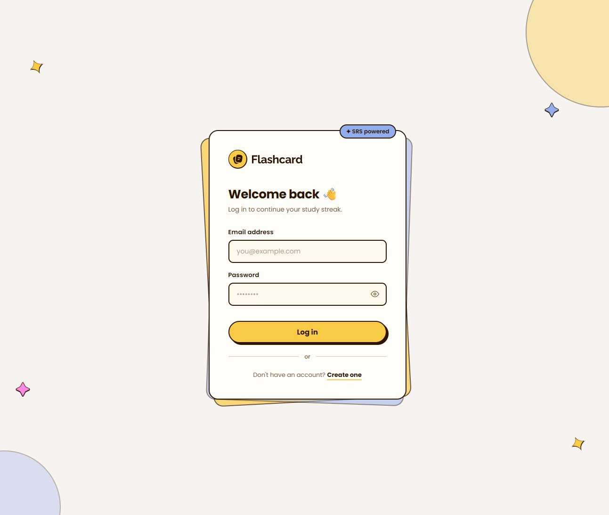

# Flashcard SRS App

A full-stack spaced repetition system (SRS) built from scratch as a portfolio project. Adapted from the Frontend Mentor Flashcard App challenge — retaining the visual design while replacing the client-side-only architecture with a real backend, JWT auth, and the SM-2 scheduling algorithm.

## Table of Contents

- [Overview](#overview)
    - [The Challenge](#the-challenge)
    - [Screenshot](#screenshot)
    - [Links](#links)
- [My Process](#my-process)
    - [Built With](#built-with)
    - [Architecture Decisions](#architecture-decisions)
    - [What I Learned](#what-i-learned)
    - [Continued Development](#continued-development)
    - [Useful Resources](#useful-resources)
    - [AI Collaboration](#ai-collaboration)
- [Setup](#setup)
    - [Prerequisites](#prerequisites)
    - [Local Development](#local-development)
    - [Environment Variables](#environment-variables)
- [API Summary](#api-summary)
- [Author](#author)

---

## Overview

### The Challenge

Users should be able to:

**Deck Management**

- Create decks with a name and optional description
- Edit and delete decks
- See card count and due count per deck from the dashboard
- View study streak and daily due count in the stats bar

**Card Management**

- Add cards (front and back) to any deck
- Edit and delete cards
- See SM-2 metadata per card: due date, ease factor, interval, repetition count

**Study Sessions**

- Study due cards one at a time using the SM-2 algorithm
- Reveal the answer and rate recall: Again / Hard / Good / Easy (maps to ratings 0, 2, 4, 5)
- Progress bar and card counter update in real time
- See a live rating breakdown chart in the sidebar during the session
- Keyboard shortcuts: `Space`/`Enter` to reveal answer, `1–4` to rate
- Session summary panel shows reviewed count and correct percentage on completion

**Auth**

- Register and login with email and password
- Silent token refresh on page load — no unnecessary redirects
- Logout clears the session server-side and client-side

### Screenshot



### Links

- Live Site: [flashcard-app-railawy](https://flashcard-app-production-d409.up.railway.app/)
- GitHub Repo: [flashcard-app](https://github.com/jezzydev/flashcard-app)

---

## My Process

### Built With

| Layer      | Technology                                                          |
| ---------- | ------------------------------------------------------------------- |
| Frontend   | Vanilla JS (ES modules), HTML, CSS                                  |
| Backend    | Node.js, Express                                                    |
| Database   | PostgreSQL, raw `pg` queries                                        |
| Auth       | JWT access token (`sessionStorage`) + HttpOnly refresh token cookie |
| Dev server | Vite (proxies `/api` to Express)                                    |
| Deployment | Railway                                                             |

### Architecture Decisions

**Monorepo layout.** Single `package.json` at root. `server/` holds all Express code, `client/` holds all frontend code. Vite handles dev-server hot reload and proxies `/api` to Express — no CORS configuration needed in development.

**JWT storage.** Access token lives in `sessionStorage` (not memory) to survive page navigation in a multi-page app without triggering an unnecessary refresh call on every load. Meaningful XSS protection comes from the HttpOnly cookie for the refresh token, CSP headers, and safe DOM handling — not from avoiding `sessionStorage`.

**Refresh token cookie path set to `/api/auth`.** The cookie is only sent to auth routes. Non-auth routes never receive it. This limits exposure without requiring any extra logic in other route handlers.

**SM-2 algorithm on the backend.** `server/utils/sm2.js` owns all scheduling math. The frontend never computes intervals or ease factors — it only sends ratings and receives updated card state. This prevents client-side tampering and keeps scheduling logic in one testable place.

**Session created on page load, reviews written per-card.** The study session is created when the page loads (not when the first card is rated). Each rating immediately writes a `session_reviews` row and updates the card's SM-2 fields. No data is held in memory waiting for a flush — a closed tab loses nothing.

**No ORMs.** All database access uses raw parameterized queries via the `pg` library. Every query is explicit and auditable.

### What I Learned

**`sessionStorage` vs in-memory token storage in an MPA.**
In-memory storage is wiped on every page navigation. In a multi-page app, that means a redundant refresh call on every load. `sessionStorage` survives navigation within the same tab and is cleared when the tab closes — which is the correct session boundary.

**Cookie path scope is about what gets sent, not what gets used.**
Setting `path: /api/auth` means the browser only attaches the refresh cookie to requests under that path. Endpoints outside that path never see the cookie, regardless of how they're implemented. This is enforced by the browser, not by server-side logic.

**SM-2 linear flow is architecturally incompatible with Previous/Next navigation.**
If a user could go back and re-rate a card, the ease factor and interval calculations would be invalidated. The session is strictly linear — once a card is rated, it's done.

**`parseInt(param, 10)` over `Number()` for URL params.**
`Number('3px')` returns `NaN`. `parseInt('3px', 10)` returns `3`. URL params are strings and can carry unexpected trailing characters. Always provide the radix.

**Persistent `document` listeners over bind/unbind for dropdown menus.**
A single `document` click listener using `e.target.closest()` handles all deck card dropdowns without binding and unbinding per-card. The bind/unbind pattern adds complexity with no meaningful performance benefit for typical UI interactions.

### Continued Development

- TypeScript migration (planned for Phase 1 of the training plan)
- React frontend rebuild (planned for Phase 1.5)
- Full Jest + Supertest test suite
- Exponential backoff on the fetch retry logic
- Rate limiting and helmet security headers for production

### Useful Resources

- [javascript.info](https://javascript.info) — Async/await, Promises, and module system deep dives
- [SM-2 Algorithm](https://www.supermemo.com/en/archives1990-2015/english/ol/sm2) — Original SuperMemo specification
- [MDN: Using HTTP cookies](https://developer.mozilla.org/en-US/docs/Web/HTTP/Cookies) — Cookie attributes, `HttpOnly`, `SameSite`, and `path`
- [Frontend Mentor](https://www.frontendmentor.io) — Original Figma design and assets this project is based on

### AI Collaboration

Used Claude (Anthropic) throughout this project as a senior engineering mentor — not as a code generator.

**How it was used:**

- Generate UI visual design for login, registration, dashboard, deck and study pages, ensuring they are consistent with the original visual design from Frontend Mentor Flashcard app challenge.
- Architecture review: JWT storage strategy, cookie path scoping, session lifecycle design
- Catching bugs before they became runtime issues (missing `client.release()` causing connection pool leaks, inverted revocation condition, logout silently skipping revocation when the access token was absent)
- Explaining the _why_ behind conventions, not just the what — event loop mechanics, ES module scoping rules, browser security threat models
- Reviewing proposed solutions and pushing back on designs that had edge cases

**What worked well:** Treating it as a code review partner rather than an autocomplete. Describing the problem and intent first, then discussing the approach, rather than asking it to write code directly.

**What didn't:** Early attempts to use it for boilerplate generation produced code that didn't fit the architecture. Writing the code myself and using it for review produced better results and more actual learning.

---

## Setup

### Prerequisites

- Node.js 18+
- PostgreSQL 14+

### Local Development

```bash
# Clone the repo
git clone <repo-url>
cd flashcard-app

# Install dependencies
npm install

# Create .env from example
cp .env.example .env
# Fill in your values (see Environment Variables below)

# Create the database
createdb flashcard_app

# Run schema
psql -d flashcard_app -f schema.sql

# Start dev server (Vite + Express via concurrently)
npm run dev
```

App runs at `http://localhost:5173`. API runs at `http://localhost:3000`. Vite proxies `/api` requests to Express.

### Environment Variables

```
DATABASE_URL=postgresql://localhost:5432/flashcard_app
JWT_SECRET=your-secret-here
JWT_REFRESH_SECRET=your-refresh-secret-here
ACCESS_TOKEN_EXPIRY=15m
REFRESH_TOKEN_EXPIRY=7d
PORT=3000
NODE_ENV=development
```

---

## API Summary

| Method | Endpoint                           | Description                                     | Auth |
| ------ | ---------------------------------- | ----------------------------------------------- | ---- |
| POST   | `/api/auth/register`               | Register new user                               | —    |
| POST   | `/api/auth/login`                  | Login, return access token + set refresh cookie | —    |
| POST   | `/api/auth/refresh`                | Refresh access token via HttpOnly cookie        | —    |
| POST   | `/api/auth/logout`                 | Logout, clear refresh cookie                    | ✓    |
| GET    | `/api/decks`                       | All decks for authenticated user                | ✓    |
| POST   | `/api/decks`                       | Create a deck                                   | ✓    |
| GET    | `/api/decks/:id`                   | Single deck with card count and due count       | ✓    |
| PUT    | `/api/decks/:id`                   | Update deck name or description                 | ✓    |
| DELETE | `/api/decks/:id`                   | Delete deck and all cards                       | ✓    |
| GET    | `/api/decks/:id/cards`             | All cards in a deck                             | ✓    |
| POST   | `/api/decks/:id/cards`             | Add a card                                      | ✓    |
| PUT    | `/api/cards/:id`                   | Edit card front or back                         | ✓    |
| DELETE | `/api/cards/:id`                   | Delete a card                                   | ✓    |
| GET    | `/api/decks/:id/study`             | Due cards for a session (max 20)                | ✓    |
| POST   | `/api/study/sessions`              | Start a study session                           | ✓    |
| POST   | `/api/study/sessions/:id/review`   | Submit card rating, run SM-2 update             | ✓    |
| PUT    | `/api/study/sessions/:id/complete` | Mark session complete                           | ✓    |
| GET    | `/api/decks/:id/stats`             | Deck stats: total, due, retention rate, streak  | ✓    |

---

## Author

- Frontend Mentor — [@jezzydev](https://www.frontendmentor.io/profile/jezzydev)
- GitHub — [@jezzydev](https://github.com/jezzydev)
