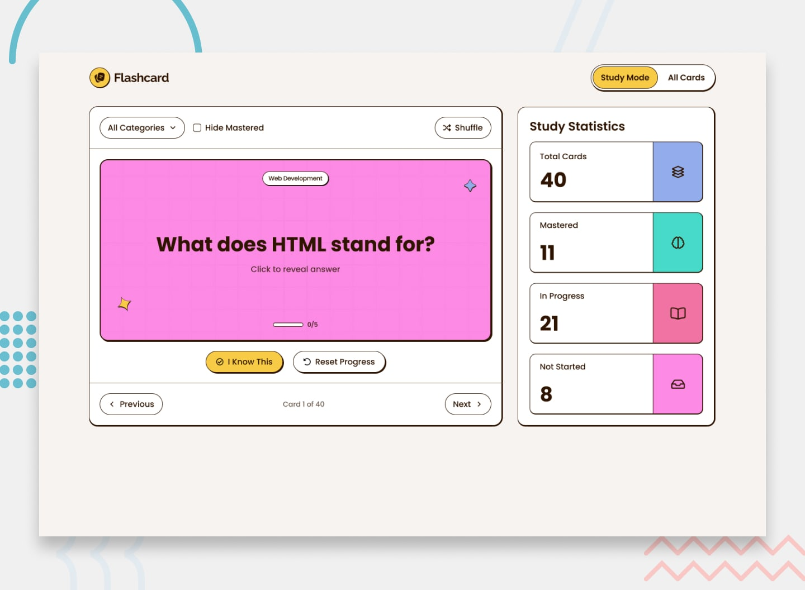

# SRS App — Project Specification

> Phase 0 — Module 0.3 | Flashcard / Spaced Repetition System  
> For use with Claude Code. This is the authoritative requirements document.  
> Make independent design decisions where the spec leaves room. Document decisions in the README.

---

## Origin: Frontend Mentor Flashcard App (Modified)

This project is based on the **Frontend Mentor premium Flashcard App** challenge — a coding challenge that provides a Figma design and assets to build a production-quality flashcard UI.



The original FM challenge is a **single-page, client-side-only** app:

- One page with a "Study Mode / All Cards" toggle
- Cards stored in `data.json`, persisted via `localStorage`
- Binary mastery tracking via "I Know This" (increments a `knownCount` 0–5)
- Category filter, shuffle, and "hide mastered" features
- No auth, no backend, no user accounts

### Modifications from the Original FM Challenge

| Original FM                    | This Project                                                            |
| ------------------------------ | ----------------------------------------------------------------------- |
| Single-page app                | Multi-page app: `login`, `register`, `dashboard`, `deck`, `study`       |
| `localStorage` for persistence | Full Express + PostgreSQL backend                                       |
| No auth                        | JWT-based auth (access token + HttpOnly refresh cookie)                 |
| "All Cards" single view        | Split into `dashboard.html` (deck list) + `deck.html` (cards per deck)  |
| Binary "I Know This"           | SM-2 four-button rating: **Again / Hard / Good / Easy** (0 / 2 / 4 / 5) |
| Simple `knownCount` 0–5        | SM-2 scheduling: `interval`, `ease_factor`, `repetitions`, `due_date`   |
| Study statistics sidebar       | Deck stats: retention rate, streak, total cards, due count              |
| Category filter                | Replaced by deck-based navigation                                       |
| "Study Mode / All Cards" nav   | "Study / Deck / Dashboard" nav                                          |
| Shuffle and hide mastered      | **Removed — out of scope**                                              |
| No logout                      | Logout button in nav                                                    |
| FM-provided `data.json` seed   | User-created decks and cards only                                       |

The FM visual design (colors, typography, card aesthetics, layout structure) is **retained as the UI foundation**. FM Figma assets are used for styling. Do not redesign the UI from scratch.

---

## Stack

| Layer      | Technology                                       |
| ---------- | ------------------------------------------------ |
| Frontend   | Vanilla JS + HTML + CSS (no frameworks)          |
| Backend    | Node.js + Express                                |
| Database   | PostgreSQL                                       |
| Auth       | JWT access token + HttpOnly refresh token cookie |
| Dev server | Vite (proxies `/api` to Express)                 |
| Deployment | Railway                                          |

**Hard constraints:**

- No ORMs — raw `pg` queries with parameterized statements only
- No frontend frameworks — vanilla JS and HTML only
- No CSS frameworks — plain CSS only
- No `alert()` — all errors displayed inline in the page
- All API calls go through a single `api.js` module (`ApiClient` class)
- Auth state managed in `auth.js`
- SM-2 algorithm lives in `server/utils/sm2.js`
- Each route file handles one resource only (`auth.js`, `decks.js`, `cards.js`, `study.js`)

---

## Requirements

### App-Wide

- All protected pages (`dashboard`, `deck`, `study`) call `requireAuth()` from `auth-init.js` on load. If no valid session exists after a silent refresh attempt, redirect to `index.html`.
- `requireAuth` owns revealing `<body>`. Page scripts own revealing page content or an error state.
- Navigation between pages uses URL search params for state: `deck.html?id=42`, `study.html?deckId=3`.
- Parse URL params with `parseInt(param, 10)` — not `Number()`.
- All scripts use `type="module"`. No `DOMContentLoaded` wrapper needed.
- Inline error messages for all form validation and API errors — never `alert()`.
- Toast notifications for non-blocking feedback (card created, deck deleted, etc.). Auto-dismiss after 3 seconds.
- Responsive layout — usable on both mobile and desktop.
- Hover and focus states on all interactive elements.
- Modals close on overlay click or `Escape` key.
- Confirmation dialog before any destructive action (delete deck, delete card).

---

### Login (`index.html`)

**Purpose:** Entry point. Authenticate an existing user.

- Fields: email, password.
- Validate both fields are non-empty before submitting.
- `POST /api/auth/login` on submit.
- On success: store access token via `auth.js`, redirect to `dashboard.html`.
- On failure: display server error message inline below the form.
- If user lands here already authenticated (valid token in `sessionStorage`), redirect to `dashboard.html` immediately.
- No "remember me" — access token lives in `sessionStorage` only.
- Link to `register.html` for new users.

---

### Registration (`register.html`)

**Purpose:** Create a new user account.

- Fields: name, email, password.
- Client-side validation before submit:
    - All fields required.
    - Email must be a valid email format.
    - Password minimum 8 characters.
    - Show validation errors inline per field.
- `POST /api/auth/register` on submit.
- On success: redirect to `index.html?registered=1`. Login page reads this param and shows a one-time success message.
- On failure: display server error inline.
- Link back to `index.html` for users who already have an account.

---

### Dashboard (`dashboard.html`)

**Purpose:** Overview of all user decks. Primary landing page after login.

**Stats bar (top of page):**

- Total decks count.
- Total cards due today across all decks.
- Current study streak in days. Streak logic: count consecutive days going backward from today where the user completed at least one study session. Streak is alive if studied today or yesterday.

**Deck list:**

- Fetch all decks via `GET /api/decks`.
- Each deck card shows: deck name, description (truncated if long), card count, due count badge.
- Due count badge is color-coded by the proportion of cards due (`due_today / total_cards`): > 70% High, > 40% Med, otherwise Low.
- Click a deck card → navigate to `deck.html?id=:deckId`.
- Empty state: if no decks exist, show a prompt to create the first deck.

**Create deck:**

- "New Deck" button opens a modal with fields: name (required), description (optional).
- `POST /api/decks` on submit.
- On success: close modal, prepend new deck card to list without full page reload.
- On failure: show error inline in the modal.

**Deck options (three-dot menu per deck card):**

- Edit → modal with pre-filled name/description, `PUT /api/decks/:deckId`.
- Delete → confirmation dialog, `DELETE /api/decks/:deckId`. On confirm: remove deck card from DOM.

**Logout:**

- Logout button in nav.
- `POST /api/auth/logout` → clears refresh cookie server-side.
- Clear access token via `auth.js`.
- Redirect to `index.html`.

---

### Deck Detail (`deck.html`)

**Purpose:** View and manage all cards in a single deck. Accessed via `deck.html?id=:deckId`.

**Header:**

- Breadcrumb: `Dashboard > [Deck Name]`.
- Deck name as page heading.

**Stats row:**

- Total cards in deck.
- Cards due today.
- Retention rate: percentage of reviews rated ≥ 3 out of all reviews for this deck. Color-coded: ≥ 70% green, 40–69% amber, < 40% red.
- Study streak (same logic as dashboard).

**"Study Now" button:**

- Active and clickable only if `due_count > 0`.
- Visually disabled (not just greyed text) when `due_count === 0`.
- On click: navigate to `study.html?deckId=:deckId`.

**Add card form (always visible, not in a modal):**

- Fields: front (textarea), back (textarea). No category field.
- Both fields required.
- `POST /api/decks/:deckId/cards` on submit.
- On success: append new card to the list, clear form fields.
- On failure: show inline error.

**Card list:**

- Fetch all cards via `GET /api/decks/:deckId/cards`.
- Each card shows:
    - Front text (truncated if long).
    - Back text (truncated if long).
    - SM-2 metadata chips: "Due today" badge if `due_date <= NOW()`, otherwise "Due in N days".
    - Ease factor as a small progress bar.
    - Interval (e.g., "6 days") and repetition count.
- Edit card: modal with pre-filled front/back, `PUT /api/cards/:cardId`.
- Delete card: confirmation dialog, `DELETE /api/cards/:cardId`. On confirm: remove from DOM.
- Empty state: if no cards, prompt to add the first one.

---

### Study (`study.html`)

**Purpose:** Active study session using SM-2. Accessed via `study.html?deckId=:deckId`.

**Session lifecycle:**

1. On page load: fetch due cards via `GET /api/decks/:deckId/study` (max 20).
2. If no due cards: show "Nothing to study" message with a link back to the deck. Do not create a session.
3. If due cards exist: `POST /api/study/sessions` to create a session (`status = 'in_progress'`). Store `sessionId`.
4. Present cards one at a time in the order returned by the API.
5. After each rating: `POST /api/study/sessions/:sessionId/review` with `{ card_id, rating }`. Backend runs SM-2 update.
6. After the last card is rated: `PUT /api/study/sessions/:sessionId/complete`. Show session summary panel.

**Card display:**

- Show card front only initially.
- "Show Answer" button reveals the back. Flip animation: front = pink/warm, back = blue (matching FM color scheme).
- Rating buttons appear only after answer is revealed.

**Rating buttons:**

- **Again** → rating `0`
- **Hard** → rating `2`
- **Good** → rating `4`
- **Easy** → rating `5`
- No Previous / Next navigation. Flow is strictly linear — a rated card cannot be re-rated in the same session.

**Progress:**

- Progress bar: `(cards reviewed / total cards) * 100%`.
- Text counter: "Card X of Y".

**Sidebar:**

- Live rating breakdown bar chart: count of Again / Hard / Good / Easy ratings so far this session.
- Session stats: total reviewed, correct count (ratings ≥ 3).

**Session complete panel (replaces card area after last rating):**

- Cards reviewed, correct count and percentage.
- "Back to Deck" link → `deck.html?id=:deckId`.

**Keyboard shortcuts:**

- `Space` or `Enter` → Show Answer (when answer is hidden).
- `1` → Again, `2` → Hard, `3` → Good, `4` → Easy (when rating buttons are visible).

---

## Auth Architecture

- **Access token**: JWT in `sessionStorage`. Sent as `Authorization: Bearer <token>` on every request.
- **Refresh token**: HttpOnly cookie, `path: /api/auth`. Sent only to auth routes.
- **`auth.js`**: Exports `getAccessToken`, `setAccessToken`, `clearAccessToken`. Gets, sets an clears access token in `sessionStorage`.
- **`api.js`**: `ApiClient` class. On `401`, calls `tryRefresh()` once. If refresh succeeds, retries original request. If it fails, redirects to `index.html`.
- **`auth-init.js`**: `requireAuth()`. Called at top of every protected page script.
- **`tryRefresh`**: Calls raw `fetch` directly (not through `ApiClient`). Returns `null` on any failure. Never makes redirect or UI decisions.

---

## SM-2 Algorithm

Runs on the backend in `server/utils/sm2.js`. Called on every `POST /api/study/sessions/:sessionId/review`.

```js
function calculateNextReview(card, rating) {
    // rating: 0=blackout, 1=incorrect, 2=incorrect but familiar,
    //         3=correct with difficulty, 4=correct, 5=perfect recall

    if (rating < 3) {
        card.interval = 1;
        card.repetitions = 0;
    } else {
        if (card.repetitions === 0) card.interval = 1;
        else if (card.repetitions === 1) card.interval = 6;
        else card.interval = Math.round(card.interval * card.easeFactor);
        card.repetitions += 1;
    }

    card.easeFactor = Math.max(
        1.3,
        card.easeFactor + 0.1 - (5 - rating) * (0.08 + (5 - rating) * 0.02),
    );

    card.dueDate = addDays(new Date(), card.interval);
    return card;
}
```

---

## Database Schema

```sql
CREATE TABLE users (
  id            SERIAL PRIMARY KEY,
  email         VARCHAR(255) UNIQUE NOT NULL,
  password_hash VARCHAR(255) NOT NULL,
  name          VARCHAR(255) NOT NULL,
  created_at    TIMESTAMP DEFAULT CURRENT_TIMESTAMP
);

CREATE TABLE decks (
  id          SERIAL PRIMARY KEY,
  user_id     INTEGER REFERENCES users(id) ON DELETE CASCADE,
  name        VARCHAR(255) NOT NULL,
  description TEXT,
  created_at  TIMESTAMP DEFAULT CURRENT_TIMESTAMP
);

CREATE TABLE cards (
  id          SERIAL PRIMARY KEY,
  deck_id     INTEGER REFERENCES decks(id) ON DELETE CASCADE,
  front       TEXT NOT NULL,
  back        TEXT NOT NULL,
  interval    INTEGER DEFAULT 1,
  ease_factor DECIMAL DEFAULT 2.5,
  repetitions INTEGER DEFAULT 0,
  due_date    TIMESTAMP DEFAULT NOW(),
  created_at  TIMESTAMP DEFAULT CURRENT_TIMESTAMP
);

CREATE TABLE study_sessions (
  id             SERIAL PRIMARY KEY,
  user_id        INTEGER REFERENCES users(id) ON DELETE CASCADE,
  deck_id        INTEGER REFERENCES decks(id) ON DELETE CASCADE,
  started_at     TIMESTAMP DEFAULT CURRENT_TIMESTAMP,
  completed_at   TIMESTAMP,
  cards_reviewed INTEGER DEFAULT 0,
  cards_correct  INTEGER DEFAULT 0
);

CREATE TABLE session_reviews (
  id          SERIAL PRIMARY KEY,
  session_id  INTEGER REFERENCES study_sessions(id) ON DELETE CASCADE,
  card_id     INTEGER REFERENCES cards(id) ON DELETE CASCADE,
  rating      INTEGER NOT NULL CHECK (rating BETWEEN 0 AND 5),
  reviewed_at TIMESTAMP DEFAULT CURRENT_TIMESTAMP
);
```

---

## API Endpoints

| Method | Endpoint                                  | Description                                     | Auth |
| ------ | ----------------------------------------- | ----------------------------------------------- | ---- |
| POST   | `/api/auth/register`                      | Register new user                               | —    |
| POST   | `/api/auth/login`                         | Login, return access token + set refresh cookie | —    |
| POST   | `/api/auth/refresh`                       | Refresh access token via HttpOnly cookie        | —    |
| POST   | `/api/auth/logout`                        | Logout, clear refresh cookie                    | ✓    |
| GET    | `/api/decks`                              | All decks for authenticated user                | ✓    |
| POST   | `/api/decks`                              | Create a deck                                   | ✓    |
| GET    | `/api/decks/:deckId`                      | Single deck with card count and due count       | ✓    |
| PUT    | `/api/decks/:deckId`                      | Update deck name or description                 | ✓    |
| DELETE | `/api/decks/:deckId`                      | Delete deck and all cards                       | ✓    |
| GET    | `/api/decks/:deckId/cards`                | All cards in a deck                             | ✓    |
| POST   | `/api/decks/:deckId/cards`                | Add a card                                      | ✓    |
| PUT    | `/api/cards/:cardId`                      | Edit card front or back                         | ✓    |
| DELETE | `/api/cards/:cardId`                      | Delete a card                                   | ✓    |
| GET    | `/api/decks/:deckId/study`                | Due cards for a session (max 20)                | ✓    |
| POST   | `/api/study/sessions`                     | Start a study session                           | ✓    |
| POST   | `/api/study/sessions/:sessionId/review`   | Submit card rating, run SM-2 update             | ✓    |
| PUT    | `/api/study/sessions/:sessionId/complete` | Mark session complete                           | ✓    |
| GET    | `/api/decks/:deckId/stats`                | Deck stats: total, due, retention rate, streak  | ✓    |

---

## Project Structure

```
/
├── server/
│   ├── index.js
│   ├── routes/
│   │   ├── auth.js
│   │   ├── decks.js
│   │   ├── cards.js
│   │   └── study.js
│   ├── middleware/
│   │   └── authenticate.js
│   └── utils/
│       └── sm2.js
├── client/
│   ├── index.html
│   ├── register.html
│   ├── dashboard.html
│   ├── deck.html
│   ├── study.html
│   ├── js/
│   │   ├── auth.js
│   │   ├── auth-init.js
│   │   ├── api.js
│   │   ├── utils.js
│   │   ├── login.js
│   │   ├── register.js
│   │   ├── dashboard.js
│   │   ├── deck.js
│   │   └── study.js
│   └── css/
├── .env
├── .env.example
├── package.json
└── vite.config.js
```

---

## Definition of Done

- [ ] All API endpoints return correct responses in Postman
- [ ] All five pages render and are fully wired to the backend
- [ ] SM-2 correctly updates `interval`, `ease_factor`, `repetitions`, and `due_date` on every review
- [ ] Full study session flow: fetch due cards → create session → review all cards → complete session
- [ ] Auth flow: register, login, logout, silent token refresh on page load all work
- [ ] Deployed to Railway and accessible via public URL
- [ ] GitHub repo has a README with: project description, setup instructions, API summary

---

## Out of Scope

Do not implement. Explicitly excluded.

- Card categories or tags
- Shuffle mode
- Hide mastered cards filter
- Card import / export
- Deck sharing between users
- Mobile app
- Email verification
- Password reset flow
